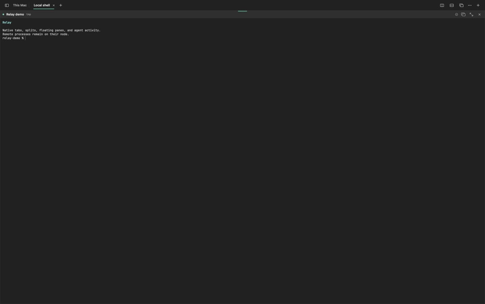

# Relay

Relay is a native macOS workspace for durable shells and agents running on remote nodes.



From a Relay-managed remote shell, `rcode file.py` opens the file in a floating Monaco pane over the terminal. Use `rcode --diff file.py` for a Git `HEAD` comparison or `rcode --diff old.py new.py` for a two-file comparison. The editor renders locally; only file operations run remotely.

Relay is a macOS terminal workspace for remote HPC systems. Shells and agents run on the selected remote node. Tabs, splits, mouse interaction, context menus, and rendering are handled by the Mac application.

## Current architecture

```text
Relay.app (macOS)
  native tabs + split tree + session rail
  GhosttyKit Metal terminal surface per pane
                 │ one multiplexed framed stream over `ssh -T` per node
                 ▼
relayd supervisor (remote, static Go binary)
  session catalog + layout state + connection multiplexer
                 │ private Unix socket
                 ▼
relay worker per pane
  durable session UUID → PTY → shell / Claude / Codex
  output replay + resize/input + structured agent events
```

A local pane maps one-to-one to a durable remote `relayd` session UUID. Splitting a remote pane creates another PTY on the same remote host and asks it to inherit the parent shell's working directory; only the visual divider is local. Closing a remote pane detaches it, so the process survives and the saved workspace can reattach later.

Relay stops terminal parsing, Metal presentation, and automatic model work while the app is inactive or the Mac is locked. Incoming bytes remain bounded in a local reconstruction buffer and are applied as one current-screen update when Relay becomes active. Screen-cache writes are debounced, identical snapshots are skipped, and each cache records its remote output cursor so relaunches request only bytes newer than the cached screen. Pane and agent channels share one reconnecting SSH node stream. On the remote node, idle process detection and worker-manifest persistence use adaptive backoff; active agents retain the faster polling intervals.

The Ghostty in-memory bridge uses one coalescing writer per surface and applies backpressure at an 8 MiB queue budget. It does not create one retained dispatch closure per SSH packet. Relay exports ten-second aggregate batch and queue-depth measurements in diagnostics, while Instruments signposts remain available for focused profiling. Relay pins the tested bridge revision from the public [`genomewalker/libghostty-spm`](https://github.com/genomewalker/libghostty-spm/tree/codex/bounded-output-queue) fork until the change is available upstream.

`relayd` and its pane workers listen only on mode-0600 Unix sockets owned by the remote user. SSH remains the authentication and transport layer; Relay opens no remote TCP port. Killing the supervisor does not close pane PTYs. A replacement supervisor validates each worker's node boot ID, PID start time, manifest, and socket handshake before reattaching. Older relayd versions fall back to one SSH stream per pane until they are updated.

## What works

- Native session-scoped tabs, recursive splits, draggable dividers, four-edge pane docking, floating panes, focus, selection, rename actions, and right-click menus
- GhosttyKit terminal rendering with Metal, true color, Unicode, links, and mouse protocols
- Detached per-pane workers with atomic manifests and supervisor-crash recovery
- Persistent remote PTYs with detach/reattach and an 8 MiB output replay ring
- Remote split creation with parent-session working-directory inheritance on Linux HPC nodes
- `~/.ssh/config` host discovery, including `Include` files; OpenSSH still resolves ProxyJump, IdentityFile, HostName, User, and Port
- Saved manual host profiles and direct SSH fallback
- Structured Claude and Codex hook events for normal agent launches inside Relay, with process-tree and output fallback detection
- Native session-rail states for working, ready, needs input, exited, and active Claude subagents
- A clickable agent-thread tree with structured tool events and identity-aware subagents; raw terminal lines never enter the sidebar
- A persistent, deduplicated "since you last checked" agent inbox spanning nodes, sessions, tabs, panes, Codex, and Claude
- Battery-aware on-device summaries, automatic focus ranking, semantic activity search, and a directional peer-coordination view using Apple Foundation Models when available; exact rule-based results remain immediate
- Node-scoped remote catalogs that discover validated detached panes before starting a new shell; older panes migrate as recoverable entries
- Sequence-based output reconnect plus acknowledged, deduplicated input for new workers; old workers remain protocol-compatible
- Persistent bounded agent-event journals with cursor replay, including a supervisor compatibility index for older workers
- Inline Kitty-graphics rendering or dismissible native previews for PNG/JPEG/GIF/WebP files referenced by remote Codex or Claude output
- Type-aware terminal links: web URLs open in the local browser, remote images open in Relay's viewer, and remote source/text paths open in a floating `rcode` pane
- Finder drag-and-drop and file paste into remote panes; relayd resolves the pane process's live working directory at transfer time, never overwrites, and inserts the resulting remote path at the prompt
- Native prompt selection in shell, Codex, and Claude panes; agent mouse reporting is bypassed only for drags that begin in the anchored input area, and Delete removes the selected input
- Live macOS Settings (`⌘,`) for font, size, terminal padding, palette, interface density, full-screen chrome, and artifact previews
- Workspace restoration using stable pane/session UUIDs
- One persistent SSH transport per connected node, with independent virtual pane and agent channels; protocol heartbeats replace even a completely frozen SSH process in about ten seconds
- Remote workspace snapshots for tabs, split geometry, floating panes, editor panes, and selection
- Per-pane input ownership and short remote-layout leases for safe multi-client attachment
- Explicit terminate/forget commands and startup-bounded retention GC that never selects running panes

Relay deliberately does not run Zellij or tmux for its layout. They can still run inside a pane, but doing so gives their text UI control of that pane again.

## Build and run

Requirements: macOS 14+, Xcode 26+, and Go 1.24+ for building the remote daemon.

```bash
swift test
./scripts/build-app.sh release
open Relay.app
```

The build script installs the runnable development bundle at
`~/Applications/Relay.app` and links `Relay.app` in the repository to it. This
keeps code signing stable when the source tree is managed by macOS File Provider.

Relay announces the remote helper on first launch. Open **Remote → Manage
relayd…** to check each SSH node, inspect the supervisor, session and pane
counts, read its bounded log, or explicitly authorize installation. Release
apps contain static Linux binaries for amd64 and arm64 inside the signed app.
Relay uploads the matching payload over SSH, verifies SHA-256 on the host, and
atomically installs it under `~/.local/share/relay/bin/`. The small
`~/.local/bin/relayd` launcher selects the correct payload at runtime, so amd64
and arm64 nodes can safely share one home. Each node has its own authenticated
supervisor socket in a private mode-0700 runtime directory. Relay never uses
`sudo` and never opens a remote TCP port. Automatic updates are opt-in and
apply only after the first explicit installation approval for that host.

The development installer remains available:

```bash
./scripts/install-relayd.sh <ssh-host>
```

The first Relay connection starts the per-user daemon automatically.

The installer adds Relay-only `claude` and `codex` shims to remote shells created by Relay. It creates an `rcode` symlink only when that name is unused or already belongs to Relay; an unrelated command is never replaced. The agent shims launch the real commands with structured hooks, while normal SSH shells keep their existing `PATH`. An explicit launch also works:

```bash
relayd agent claude
```

Create signed release artifacts with:

```bash
RELAY_CODESIGN_IDENTITY="Developer ID Application: …" \
RELAY_NOTARY_PROFILE=relay-notary \
./scripts/package-release.sh
```

The package script emits a drag-to-Applications DMG, a ZIP for automated deployment, static Linux `relayd` binaries for amd64 and arm64, and SHA-256 checksums. Public packaging requires a Developer ID and notary profile, then notarizes and staples both the app and its DMG. GitHub Actions mounts every generated DMG and verifies the app executable, Applications shortcut, and code signature; tagged releases use the signing and Apple notarization secrets documented in the release workflow.

Install a release by opening `Relay-<version>-macOS.dmg` and dragging Relay to Applications. macOS updates replace only the local application; remote workers and workspace state remain on their nodes and reattach on launch.

## Keyboard

Press `⌘Q` twice within two seconds to quit Relay. Holding the keys does not count as a second press, and remote sessions remain running.

- `⌘D`: split right
- `⇧⌘D`: split down
- `⌘W`: detach/close the active pane
- `⌥⌘[` / `⌥⌘]`: previous/next pane
- `⇧⌘Return`: zoom/restore the active pane
- `⌥⌘P`: float/dock the active pane
- `⇧⌘[` / `⇧⌘]`: previous/next tab
- `⇧⌘↑` / `⇧⌘↓`: previous/next semantic shell prompt
- `⌥⌘I`: show or hide the cross-session agent activity inbox
- `⌘,`: settings

Change Relay shortcuts in **Settings → Keyboard → Customize shortcuts**. Relay rejects duplicate assignments, lets each action be reset independently, and reserves `⌘W` for closing or detaching the active pane instead of the workspace window.

Drag a pane by its connection header and drop it near another pane's left, right, top, or bottom edge to dock it there. Drop in the center to swap tiled panes. The remote PTYs keep their identities and continue running during the move.

## Current limits

- Relay accepts versioned Codex app-server JSON-RPC and Claude stream-json events through `relayd event --stream`; the existing interactive TUIs still use structured hooks plus a transcript compatibility fallback until they emit that stream directly
- Finder transfer currently accepts regular files up to 64 MiB each; directory and resumable transfers are not implemented yet
- Multiple independent workspace windows are not supported yet; the current app owns one workspace model and one input owner per remote pane
- The local 2 MiB-per-pane screen cache is display-only; searchable command/output history is not persisted beyond the remote replay and structured event journals
- Signed public builds require the repository owner’s Developer ID and Apple notarization credentials

## Performance benchmarks

`./scripts/benchmark-relay.sh` runs repeatable wire-protocol microbenchmarks and samples idle app CPU, resident memory, and thread count once per second. It also captures before/after VM summaries and a short stack sample so memory growth and wakeup sources can be compared between builds. Set `RELAY_BENCHMARK_SECONDS` to change the sample window. The script prints an `xctrace` Energy Log command for battery measurements; the trace stays separate because Instruments needs an interactive capture session.

## License

No project license has been selected. Public source visibility does not grant redistribution rights. Third-party packages retain their own licenses.
